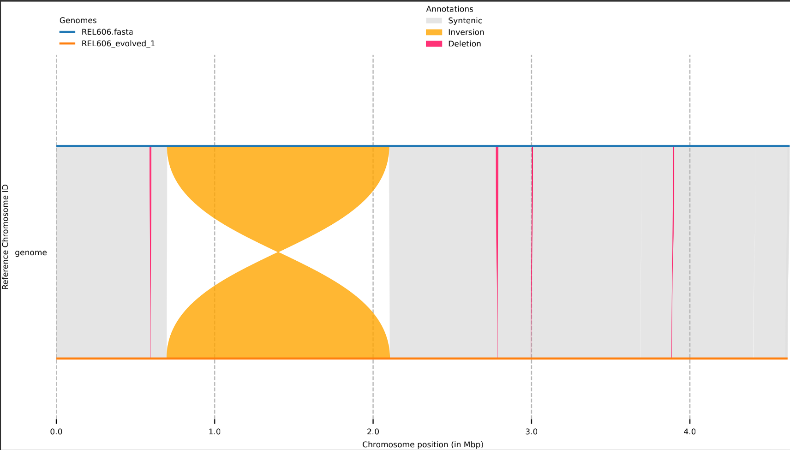
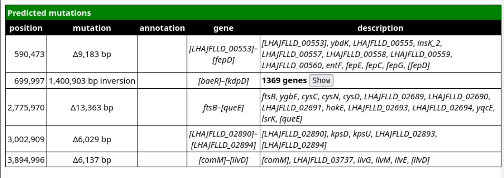

# Tutorial 

This is a tutorial with example data for _seabreeze_. Please [install the software, create the conda enviroment and activate it](installation.md ) first. 

To get started, navigate to the root of the _seabreeze_ directory, and copy the `example/` directory:
```
cp -r example/ data/
```

The newly created `data/` folder should look like this:
```
|---data/
|   |
|   |---data.csv
|   |---ori_dif_sequences.csv
|   |---02_genomes/
|   |   |
|   |   |---REL606_evolved_1.fasta
|   |   |---REL606_evolved_2.fasta
|   |   |---REL606.fasta
```

For this tutorial, structural variant mutations have been simulated on the *E. coli* strain REL606 genome using _breseq_. These mutated genome assemblies are `REL606_evolved_1.fasta` and `REL606_evolved_2.fasta`. We aim to identify the structural variants in these assemblies relative to their ancestor, `REL606.fasta`. These pairwise comparisons to be performed are specified in a csv file called `data.csv` in the `data/` directory.  For more information about the valid format of this file, please see the [usage](usage.md) page.

To view this csv file:
```
cat data/data.csv
```

It should look like this:

| assembly         | ancestor |  
| ---------------- | -------- | 
| REL606           | REL606   |  
| REL606_evolved_1 | REL606   |  
| REL606_evolved_2 | REL606   |    

We include a comparison of `REL606` to itself as a quality check step, as we do not expect any mutations when a genome is compared to itself.

All of the following commands should be run from the _seabreeze_ root directory. Here, 4 cores have been allocated to run _seabreeze_ but this number can be higher on lower depending on your hardware. 

## Analyse genome sizes

This command compares the sizes of the assemblies to their specified ancestors in a pairwise manner. 

```
seabreeze batch --dir data/ --data data/data.csv analyse_genome_sizes
```

The output file generated is `data/04_rename_genome/unmasked/genome_size_stats.csv`. Please see [output](output.md) for more information about the fields in this table. This table should look this this:

| assembly         | ancestor | size_assembly | size_ancestor | difference | percent_change |
| ---------------- | -------- | ------------- | ------------- | ---------- | -------------- |
| REL606           | REL606   | 4629812       | 4629812       | 0          | 0.0            |
| REL606_evolved_1 | REL606   | 4617111       | 4629812       | -12701     | -0.2743        |
| REL606_evolved_2 | REL606   | 4549910       | 4629812       | -79902     | -1.7258        |

As we expected, there is no size difference when `REL606` is compared to itself. We can see that both of the assemblies `REL606_evolved_1` and `REL606_evolved_2` are smaller than the ancestor.

## Find insertion sequences

This command uses [ISEscan](https://github.com/xiezhq/ISEScan/blob/master/README.md?plain=1) to annotate partial and full-length IS elements in the genomes. 
```
seabreeze batch --dir data --data data/data.csv predict_IS_elements 
```

All of the output generated is stored in `data/05_isescan_tables/`. This tutorial should generate the following files in this directory:

```
|---data/
|   |---05_isescan_tables/
|   |   |
|   |   |---REL606.csv
|   |   |---REL606_evolved_1.csv
|   |   |---REL606_evolved_2.csv
|   |   |---REL606/
|   |   |---REL606_evolved_1/
|   |   |---REL606_evolved_2/
```
Each assembly has a .csv file that describes the locations of IS elements in that genome, and a directory where the additionally files generated by _ISEScan_ are made. For information about interpreting this csv file, we refer users to the official [ISEScan documentation](https://github.com/xiezhq/ISEScan/blob/master/README.md).

## Predict SVs

This command aligns the assembly-ancestor pairs, predicts structural variants and generates synteny plots. 

```
seabreeze batch --dir data --data data/data.csv predict_structural_variants 
```

This will generate the following directories:
```
|---data/
|   |---06_nucmer_alignment/
|   |   |---unmasked
|   |   |   |---REL606/
|   |   |   |---REL606_evolved_1/
|   |   |   |---REL606_evolved_2/
|   |   |
|   |---07_syri_output/
|   |   |---unmasked
|   |   |   |---REL606/
|   |   |   |---REL606_evolved_1/
|   |   |   |---REL606_evolved_2/
```

We are primarily interested in a table describing the SVs and the synteny plot. This command also generates other files that may be useful, but are not required. Please see [output](output.md) for information about those files.

Let's look at the SVs for `REL606_evolved_1`
```
cd data/07_syri_output/unmasked/REL606_evolved_1
cat REL606_evolved_1_clean.syri.out | cut --complement -f 4-5
```

This command prints the tsv file `REL606_evolved_1_clean.syri.out` to the terminal, while hiding the 4th and 5th columns. These columns show the reference/query sequences for indels, and hence can be quite large. Note that older versions of the UNIX `cut` command may not support the `--complement` option, and you may need to either update `cut` or use other UNIX commands to hide the 4th and 5th columns. You can also view this file with a spreadsheet application, as it a tsv file. 

```
genome	1	    590471	genome	1	    595344	SYN1	-	SYN	-
genome	590473	599656	genome	595344	595344	DEL	-	DEL	-
genome	599657	700001	genome	595345	697137	SYN5	-	SYN	-
genome	699997	2100900	genome	697133	2105267	INV15	-	INV	-
genome	2100896	2775884	genome	2105263	2784492	SYN7	-	SYN	-
genome	2775970	2789333	genome	2784492	2784492	DEL	-	DEL	-
genome	2789334	3697156	genome	2784487	3686254	SYN11	-	SYN	-
genome	3002909	3008938	genome	2998062	2998062	DEL6	SYN11	DEL	-
genome	3697154	4415713	genome	3687698	4400119	SYN12	-	SYN	-
genome	3894996	3901133	genome	3885540	3885540	DEL7	SYN12	DEL	-
genome	4415710	4629812	genome	4401562	4617111	SYN13	-	SYN	-
genome	4615673	4629812	genome	4602972	4617111	SYN14	-	SYN	-

```
We refer the user to the official [SyRI documentation](https://schneebergerlab.github.io/syri/fileformat.html) for information on interpreting this table. You may notice that the reference and query chromosome ID may read as "genome". This is because SyRI attempts to call variants between homologous chromosomes, and hence expects the reference and query ID to be the same string. To prevent this error from occurring, the genomes are renamed to a placeholder string 'genome'. 

Let us view the synteny plot  `REL606_evolved_1_clean.plot.pdf` in this same directory. It can be opened with any application that allows you to view a PDF. 



The ancestor genome is the blue line, and the orange line is the evolved genome REL606_evolved_1. The grey ribbons show syntenic regions. We can see that there was one large inversion (in yellow) and several smaller deletions across the genome (in red).

One of the steps that _seabreeze_ performs is to remove false positive SV calls and misassigned SVs. As an example of what this synteny plot looks like before this processing, we can view the plot `REL606_evolved_1.plot.pdf` 


Two deletions (~0.5Mb and ~2.8Mb) were not correctly called. There also appear to be many small "duplications". These correspond to spurious alignments between the many copies of IS elements, and do not always represent bona fide instances of structural variant mutations. It should also be noted that _seabreeze_ does not track IS transposition events.

## Annotate genes in SVs

To annotate the genes present in the deletions, inversions and amplifications, run this command. Make sure you navigate back to the _seabreeze_ root directory before that.

```
seabreeze batch --dir data --data data/data.csv annotate_SV_regions  
```

The primary output generated by this command are a series of html files in 

```
|---data/
|   |---12_genome_diff_tables
|   |   |---html
|   |   |   |---unmasked
|   |   |   |   |---REL606.html
|   |   |   |   |---REL606_evolved_1.html
|   |   |   |   |---REL606_evolved_2.html
```

Let us look at `REL606_evolved_1.html` as an example. This file can be opened by your web browser application.
 

This table describes the mutations, their type, location and the genes present in them. For more information on this table, please see [breseq documentation](https://gensoft.pasteur.fr/docs/breseq/0.35.0/output.html#html-human-readable-output). 

## Predict SV mechanism

Most structural variant mutations occur through recombination between homologous sites and insertion sequences in particular are often involved. This command annotates the insertion sequences at the boundaries of structural variants (for deletions and inversions only) and predicts putative mechanisms.

```
seabreeze batch --dir data --data data/data.csv predict_SV_mechanism 
```

This command generates several files: two summary files `deletion_mechanism.csv` and `inversion_mechanism.csv`, and three files for each of the three assemblies:

```
|---data/
|   |---11_annotated_boundaries
|   |   |---unmasked
|   |   |   |---deletion_mechanism.csv
|   |   |   |---inversion_mechanism.csv
|   |   |   |---REL606_boundaries.csv
|   |   |   |---REL606_deletion.csv
|   |   |   |---REL606_inversion.csv
|   |   |   |---REL606_evolved_1_boundaries.csv
|   |   |   |---REL606_evolved_1_deletion.csv
|   |   |   |---REL606_evolved_1_inversion.csv
|   |   |   |---REL606_evolved_2_boundaries.csv
|   |   |   |---REL606_evolved_2_deletion.csv
|   |   |   |---REL606_evolved_2_inversion.csv
```

Let's look at the output for the assembly `REL606_evolved_1_deletion.csv`, which describes the putative mechanism of the deletions:

| ref_start | ref_stop | query_start | query_stop | tag_3 | L_ref  | L_ref_distance | R_ref | R_ref_distance | L_query | L_query_distance | R_query | R_query_distance | Mechanism   | Evidence |
| --------- | -------- | ----------- | ---------- | ----- | ------ | -------------- | ----- | -------------- | ------- | ---------------- | ------- | ---------------- | ----------- | -------- |
| 590473    | 599656   | 595344      | 595344     | DEL   |        | 0              |       | 0              |         | 0                |         | 0                | other       | NA       |
| 2775970   | 2789333  | 2784492     | 2784492    | DEL   |        | 0              |       | 0              | IS3_61  | -7               | IS3_61  | 7                | IS_mediated | evolved  |
| 3002909   | 3008938  | 2998062     | 2998062    | DEL   |        | 0              |       | 0              |         | 0                |         | 0                | other       | NA       |
| 3894996   | 3901133  | 3885540     | 3885540    | DEL   | IS3_61 | 0              |       | 0              | IS3_61  | 0                | IS3_61  | 0                | IS_mediated | full     |

We see that two deletions seem to involve IS3_61. For more information about this table, please see the [output documentation](output.md).

Now let us look at the output for the assembly `REL606_evolved_1_inversion.csv`, which describes the putative mechanism of the inversions:

|ref_start|ref_stop|query_start|query_stop|tag_3|L_ref|L_ref_distance|R_ref|R_ref_distance|L_query|L_query_distance|R_query|R_query_distance|Mechanism|Evidence|
|---|---|---|---|---|---|---|---|---|---|---|---|---|---|---|
|699997|2100900|697133|2105267|INV||0||0||0||0|other|NA|

There was only a single inversion in this assembly, which occurred by an unknown mechanism _seabreeze_ could not predict.

Looking at the summary file `deletion_mechnism.csv`, we can at a glance look at the mechanism for deletions in all of the assemblies:

| clone                           | total | between_IS | IS_mediated | other |
| ------------------------------- | ----- | ---------- | ----------- | ----- |
| REL606       | 0     | 0          | 0           | 0     |
| REL606_evolved_2| 4     | 0          | 1           | 3     |
| REL606_evolved_1 | 4     | 0          | 2           | 2     |

Similarly, for the inversions in `inversion_mechanism.csv`:

|clone|total|between_IS|IS_mediated|other|
|---|---|---|---|---|
|REL606|0|0|0|0|
|REL606_evolved_2 |2|1|0|1|
|REL606_evolved_1|1|0|0|1|

## Predict replichore and inversion balance

For bacterial genomes that have a single origin and terminus, the genome can be divided into two replichores (halves) demarcated by the origin-terminus axis. It can be useful to know how the lengths of these two replichores differ between the ancestor-assembly pairs. In this figure, the two replichores have been depicted in yellow and green.

 

The origin-terminus axis can also be used to classify inversions as inter-replichore (if they occur across the axis) or intra-replichore if they are contained within a single replichore. This figure depicts an inter-replichore inversion across the origin, and an intra-replichore inversion within the green replichore.


For inter-replichore inversions, we can describe the symmetry of the inversion across the axis. Asymmetric inversions can cause the length of the two replichores to change.


This step requires user input (in addition to `data/data.csv`) to specify the sequences of the origin and terminus. For the origin, we recommend the *oriC* sequence, and for the terminus, we recommend the *dif* sequence. _seabreeze_ looks for these sequences (or the reverse complement) in the genome for an exact and unique match, and will cause an error if an exact match is not found, or more than one exact match is found. There is no minimum/maximum length requirements for the supplied _oriC_ and _dif_ sequences as long as they meet the above criteria. _seabreeze_ requires these two sequences for each ancestor, and assumes that the sequences have not mutated in the corresponding ancestor. This information is specified in a csv file in `data/ori_dif_sequences.csv`. 

Let us view this file for our example:

```
cat data/ori_dif_sequences.csv
```

We should be able to see this table:

| ancestor | ori                | dif                |
| -------- | ------------------ | ------------------ |
| REL606   | GGATCCTGGGTATTAAAA | TCTTCCTTGGTTTATATT |

These sequences are the first few bases of the _oriC_ and _dif_ loci for _E. coli_. More information about what sequences are acceptable in this table are on the [usage](usage.md) page. 

We can now run the command from the _seabreeze_ root directory:

```
seabreeze batch --dir data --data data/data.csv --oridif data/ori_dif_sequences.csv predict_replichore_balance 
```

This step generates several output files. First, let us look at the file that describes the lengths of the replichores in the assemblies `data/08_reindex_genome_oric/replichore_arms.csv`.

|clone|ori|dif|length|arm_1|arm_2|ratio|percent|
|-----|----|---|---|---------|-----|----|--------|
|REL606|0.0|2311092.0|4629812.0|2311092.0|2318720.0|1.003|50.082|
|REL606_evolved_1|0.0|1972601.0|4617111.0|1972601.0|2644510.0|1.341|57.276|
|REL606_evolved_2|0.0|1708781.0|4549910.0|1708781.0|2841129.0|1.663|62.444|


For more information, about this table, please see the [output](output.md) page. `arm_1` and `arm_2` describe the length of the two replichores, and `percent` describes the percent of the total length of the genome that is in the longer replichore. This value is 50 for a perfectly balanced genome, and increases with increasing imbalance. We can see that both `REL606_evolved_1` and `REL606_evolved_2` are less balanced than `REL606`. 

Now, let's look at the classification of the inversions in the assemblies in `data/11_annotated_boundaries/unmaskedinversion_replichores_long.csv`. This file contains a list of all of the inversions across all of the assemblies.

| clone            | classification | length  | mechanism  | symmetry_percent   |    
| ---------------- | -------------- | ------- | ---------- | ------------------ | 
| REL606_evolved_2 | across_dif     | 1500794 | other      | 75.52768734416581  | 
| REL606_evolved_2 | across_ori     | 1070041 | between_IS | 57.700686235387245 |   
| REL606_evolved_1 | across_dif     | 1400903 | other      | 61.914707870566346 |

We can see that the assembly `REL606_evolved_2` had two inversions, one across the terminus and one across the origin, while `REL606_evolved_1` had only one inversion across the terminus. The symmetry of each of these inversions is described by the `symmetry_percent` field, which is the percent of the total length of the inversion that is in the longer arm of the inversion. This value is 50 for a perfectly symmetric inversion and becomes larger as the inversion becomes more asymmetric. 


